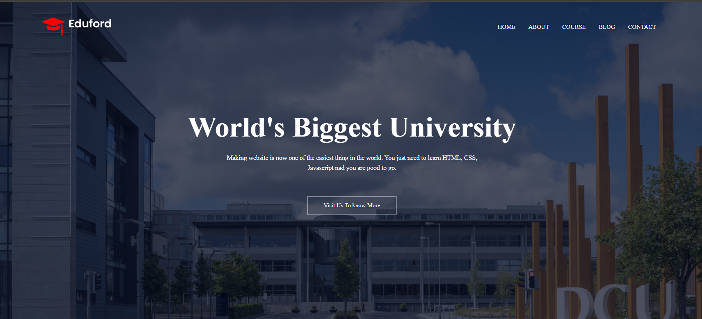

# 🎓 Eduford - University Website

A modern, responsive educational website built using **HTML**, **CSS**, and **JavaScript**. Eduford showcases a fictional university with information about courses, global campuses, facilities, testimonials, and more. It’s designed to work seamlessly across devices with a clean UI and intuitive layout.



## 🚀 Features

- Fully responsive layout (mobile, tablet, desktop)
- Interactive navigation menu
- Animated call-to-action sections
- Testimonials with star ratings
- Sections: Home, course, blog, contact
- Font Awesome Icons integration
- Smooth and user-friendly design

---


## 📁 Folder Structure

Eduford/

├── images/ # All image assets

├── index.html # Main homepage

├── About.html # About us page

├── Course.html # Course information page

├── Blog.html # Blog/articles

├── Contact.html # Contact form

├── style.css # Custom styling


---


## 🚀 Live Demo

You can check out the deployed project here:  
👉 https://harishna-k.github.io/Eduford_website/

---

## 🛠️ Installation & Usage

1. **Clone the repository:**
   ```bash
   git clone https://github.com/Harishna-K/Eduford_website.git
   cd Eduford_website
   
2. Open index.html in your browser
   Or use Live Server in VS Code.

## 🛠️ Technologies Used

- **HTML5**
- **CSS3**
- **JavaScript**
- **Font Awesome (CDN)**

---

